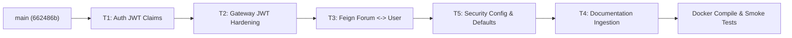

# Cẩm nang hợp nhất mã nguồn (Merge-Prep Runbook)

**Dự án**: Smart Agriculture Management System  
**Ngày lập**: 2026-10-08  
**Mục tiêu**: Hướng dẫn chi tiết từng bước cho kỹ sư phụ trách hợp nhất (Merge Operator) để tích hợp an toàn toàn bộ 5 nhánh phát triển vào nhánh chính `main` (commit gốc `662486b`).  
**Trạng thái kiểm toán**: Đã kiểm tra không xung đột (Zero File Overlap / Zero Merge Conflicts).

---

## 1. Thứ tự hợp nhất khuyến nghị (Recommended Merge Order)

Nhằm đảm bảo tính nhất quán của hợp đồng giao tiếp (Contract Integrity) và khả năng kiểm thử lũy tiến giữa các dịch vụ, thứ tự hợp nhất bắt buộc phải thực hiện theo quy trình sau:



### Chi tiết lộ trình hợp nhất:
1. **Bước 1 - Hợp nhất T1 (`veejvn/t1-auth-jwt-claims`)**:
   - **Lý do**: Đây là nền tảng khởi tạo hợp đồng Token JWT. T1 bổ sung các claim bắt buộc `userId` và `roles` vào JWT payload trong `auth-service` (cả ở luồng đăng nhập và refresh token). Mọi thành phần phía sau (Gateway và microservices) đều phụ thuộc vào định dạng token mới này.
2. **Bước 2 - Hợp nhất T2 (`veejvn/t2-gateway-jwt`)**:
   - **Lý do**: API Gateway là trạm kiểm soát biên giới. T2 nạp bộ lọc `JwtAuthenticationGlobalFilter`, bắt buộc xác thực chữ ký, yêu cầu nghiêm ngặt claim `userId` (trả về 401 nếu thiếu/rỗng), xóa triệt để các header giả mạo danh tính từ client (`X-User-Id`, `X-Username`, `X-Roles`), và cho phép CORS Preflight HTTP `OPTIONS` đi qua.
3. **Bước 3 - Hợp nhất T3 (`veejvn/t3-feign-forum-user`)**:
   - **Lý do**: Triển khai giao tiếp OpenFeign liên dịch vụ giữa Forum Service và User Service. T3 loại bỏ giá trị mặc định không an toàn `defaultValue = "1"` tại `user-service`, đồng thời thiết lập che giấu dữ liệu nhạy cảm thông qua `UserProfileViewDTO`.
4. **Bước 4 - Hợp nhất T5 (`veejvn/t5-security-config`)**:
   - **Lý do**: Hoàn tất việc gỡ bỏ giá trị mặc định `defaultValue = "1"` ở 2 dịch vụ còn lại (`crop-service` và `notification-service`). Đồng thời đồng bộ hóa biến môi trường `APP_JWT_SECRET` giữa `docker-compose.yml`, `api-gateway` và `auth-service`.
5. **Bước 5 - Tích hợp tài liệu T4 (`veejvn/t4-security-review`)**:
   - **Cách đưa tài liệu T4 vào**: Xem hướng dẫn chi tiết ở mục 1.1 bên dưới.

---

### 1.1. Cách tích hợp tài liệu từ nhánh T4 (Bringing in T4 Docs)

Nhánh T4 (`veejvn/t4-security-review`) **hoàn toàn chỉ chứa tài liệu Markdown** nằm trong thư mục `docs/`, không chỉnh sửa bất kỳ dòng mã nguồn nào. Kỹ sư có thể chọn 1 trong 2 phương pháp sau:

#### Cách 1: Git Merge trực tiếp (Khuyến nghị)
Sau khi đã hoàn tất merge T1, T2, T3, T5 vào `main`, thực hiện merge nhánh T4:
```powershell
# Chuyển về nhánh main
git checkout main

# Merge nhánh tài liệu T4 với commit merge rõ ràng
git merge veejvn/t4-security-review --no-ff -m "docs: merge security review reports and merge runbook from T4"
```

#### Cách 2: Sao chép thư mục tài liệu từ Worktree T4
Nếu merge thủ công hoặc muốn kiểm soát từng file:
```powershell
# Từ thư mục gốc repo main, tạo thư mục docs nếu chưa có
New-Item -ItemType Directory -Force -Path docs/security

# Sao chép các tệp tài liệu từ worktree T4
Copy-Item "C:\Users\Hoang Ve\orca\workspaces\smart-agriculture-system\t4-security-review\docs\security\*" "docs\security\" -Force
Copy-Item "C:\Users\Hoang Ve\orca\workspaces\smart-agriculture-system\t4-security-review\docs\MERGE_GUIDE.md" "docs\" -Force

# Thêm và commit vào git
git add docs/
git commit -m "docs: add security review reports (fix wave, residuals) and merge guide"
```

---

## 2. Bảng kê chi tiết tệp tin thay đổi theo từng nhánh (Per-Branch File Inventory)

Dữ liệu được trích xuất trực tiếp bằng `git status --porcelain` và `git diff --stat` trên từng worktree:

### 2.1. Nhánh T1: `veejvn/t1-auth-jwt-claims`
- **Thư mục làm việc**: `C:\Users\Hoang Ve\orca\workspaces\smart-agriculture-system\t1-auth-jwt-claims`
- **Trạng thái tệp tin (`git status --porcelain`)**:
  ```text
  M backend/auth-service/src/main/java/com/agriculture/auth/controller/AuthController.java
  M backend/auth-service/src/main/java/com/agriculture/auth/security/JwtUtils.java
  ```
- **Thống kê chi tiết thay đổi (`git diff --stat`)**:
  ```text
  backend/auth-service/src/main/java/com/agriculture/auth/controller/AuthController.java |  2 +-
  backend/auth-service/src/main/java/com/agriculture/auth/security/JwtUtils.java         | 14 +++++++++++---
  2 files changed, 12 insertions(+), 4 deletions(-)
  ```

### 2.2. Nhánh T2: `veejvn/t2-gateway-jwt`
- **Thư mục làm việc**: `C:\Users\Hoang Ve\orca\workspaces\smart-agriculture-system\t2-gateway-jwt`
- **Trạng thái tệp tin (`git status --porcelain`)**:
  ```text
  M backend/api-gateway/pom.xml
  M backend/api-gateway/src/main/resources/application.yml
  ?? backend/api-gateway/SECURITY.md
  ?? backend/api-gateway/src/main/java/com/agriculture/gateway/security/JwtAuthenticationGlobalFilter.java
  ```
- **Thống kê chi tiết thay đổi (`git diff --stat`)**:
  ```text
  backend/api-gateway/pom.xml                            | 17 +++++++++++++++++
  backend/api-gateway/src/main/resources/application.yml |  5 +++++
  2 files changed, 22 insertions(+)
  ```
  *(Kèm 2 tệp tin mới untracked: `SECURITY.md` và `JwtAuthenticationGlobalFilter.java`)*

### 2.3. Nhánh T3: `veejvn/t3-feign-forum-user`
- **Thư mục làm việc**: `C:\Users\Hoang Ve\orca\workspaces\smart-agriculture-system\t3-feign-forum-user`
- **Trạng thái tệp tin (`git status --porcelain`)**:
  ```text
  M backend/forum-service/pom.xml
  M backend/forum-service/src/main/java/com/agriculture/forum/ForumServiceApplication.java
  M backend/forum-service/src/main/java/com/agriculture/forum/controller/ForumController.java
  M backend/forum-service/src/main/java/com/agriculture/forum/service/ForumService.java
  M backend/user-service/src/main/java/com/agriculture/user/controller/FarmLocationController.java
  M backend/user-service/src/main/java/com/agriculture/user/controller/UserProfileController.java
  ?? backend/forum-service/src/main/java/com/agriculture/forum/client/UserProfileClient.java
  ?? backend/forum-service/src/main/java/com/agriculture/forum/config/FeignHeaderForwardingConfiguration.java
  ?? backend/forum-service/src/main/java/com/agriculture/forum/dto/AuthorProfileDTO.java
  ?? backend/forum-service/src/main/java/com/agriculture/forum/dto/CommentResponseDTO.java
  ?? backend/forum-service/src/main/java/com/agriculture/forum/dto/PostResponseDTO.java
  ?? backend/user-service/src/main/java/com/agriculture/user/dto/UserProfileViewDTO.java
  ```
- **Thống kê chi tiết thay đổi (`git diff --stat`)**:
  ```text
  backend/forum-service/pom.xml                                                                    |  4 ++
  backend/forum-service/src/main/java/com/agriculture/forum/ForumServiceApplication.java           |  2 +
  backend/forum-service/src/main/java/com/agriculture/forum/controller/ForumController.java       | 16 +++---
  backend/forum-service/src/main/java/com/agriculture/forum/service/ForumService.java              | 58 ++++++++++++++++++----
  backend/user-service/src/main/java/com/agriculture/user/controller/FarmLocationController.java  |  4 +-
  backend/user-service/src/main/java/com/agriculture/user/controller/UserProfileController.java   | 14 +++++-
  6 files changed, 76 insertions(+), 22 deletions(-)
  ```
  *(Kèm 6 tệp tin mới untracked cho Feign client, config, và DTO)*

### 2.4. Nhánh T5: `veejvn/t5-security-config`
- **Thư mục làm việc**: `C:\Users\Hoang Ve\orca\workspaces\smart-agriculture-system\t5-security-config`
- **Trạng thái tệp tin (`git status --porcelain`)**:
  ```text
  M backend/auth-service/src/main/resources/application.yml
  M backend/crop-service/src/main/java/com/agriculture/crop/controller/FarmPlotController.java
  M backend/notification-service/src/main/java/com/agriculture/notification/controller/NotificationController.java
  M docker-compose.yml
  ```
- **Thống kê chi tiết thay đổi (`git diff --stat`)**:
  ```text
  backend/auth-service/src/main/resources/application.yml                                          | 2 +-
  backend/crop-service/src/main/java/com/agriculture/crop/controller/FarmPlotController.java       | 4 ++--
  backend/notification-service/src/main/java/com/agriculture/notification/controller/NotificationController.java | 4 ++--
  docker-compose.yml                                                                               | 1 +
  4 files changed, 6 insertions(+), 5 deletions(-)
  ```

### 2.5. Nhánh T4: `veejvn/t4-security-review`
- **Thư mục làm việc**: `C:\Users\Hoang Ve\orca\workspaces\smart-agriculture-system\t4-security-review`
- **Trạng thái tệp tin**:
  ```text
  ?? docs/security/SECURITY_REVIEW_GATEWAY_FEIGN.md
  ?? docs/security/SECURITY_REVIEW_FIX_WAVE.md
  ?? docs/security/SECURITY_REVIEW_RESIDUALS.md
  ?? docs/MERGE_GUIDE.md
  ```
  *(Chỉ có tài liệu Markdown, 0 tệp tin mã nguồn bị sửa đổi)*.

---

## 3. Phân tích giao thoa tệp tin (Explicit Overlap Analysis)

Để chứng minh rằng toàn bộ quá trình merge sẽ diễn ra **hoàn toàn sạch sẽ (Clean Merge, 0 Merge Conflict)**, bảng đối chiếu giao thoa giữa từng cặp nhánh được xác lập dưới đây:

### 3.1. Bảng ma trận giao thoa tệp tin (File Intersection Matrix)

| Nhánh đối chiếu | T1 (`auth-jwt`) | T2 (`gateway-jwt`) | T3 (`feign-forum-user`) | T5 (`security-config`) | T4 (`security-review`) |
|---|:---:|:---:|:---:|:---:|:---:|
| **T1 (`auth-jwt`)** | - | **0 file** | **0 file** | **0 file** *(Xem ghi chú)* | **0 file** |
| **T2 (`gateway-jwt`)** | **0 file** | - | **0 file** | **0 file** | **0 file** |
| **T3 (`feign-forum-user`)** | **0 file** | **0 file** | - | **0 file** | **0 file** |
| **T5 (`security-config`)** | **0 file** | **0 file** | **0 file** | - | **0 file** |
| **T4 (`security-review`)** | **0 file** | **0 file** | **0 file** | **0 file** | - |

> [!NOTE]
> **Điểm chú ý đặc biệt tại `auth-service`**:
> - Nhánh **T1** chỉ chỉnh sửa mã nguồn Java: `AuthController.java` và `JwtUtils.java`.
> - Nhánh **T5** chỉ chỉnh sửa tệp cấu hình YAML: `backend/auth-service/src/main/resources/application.yml`.
> Hai nhánh chỉnh sửa 2 tệp tin hoàn toàn độc lập trong cùng một service $\rightarrow$ Giao thoa bằng rỗng: $\text{Files}(T1) \cap \text{Files}(T5) = \emptyset$.

### 3.2. Kết luận chứng minh tính độc lập (Proof of Clean Merge)
Tổng số tệp tin bị tác động trên cả 4 nhánh code (T1, T2, T3, T5) là **22 tệp tin riêng biệt**:
- Không có bất kỳ 2 nhánh nào cùng chỉnh sửa vào một tệp tin.
- Git 3-Way Merge thuật toán sẽ tự động fast-forward hoặc clean merge 100% mà không xuất hiện bất kỳ conflict marker nào (`<<<<<<< HEAD`).

---

## 4. Danh mục kiểm tra sau hợp nhất (Post-Merge Verification Checklist)

### 4.1. Lệnh biên dịch Maven qua Docker (Docker-based Maven Compile)
Sử dụng image Docker chính thức `maven:3.9.9-eclipse-temurin-17` để đảm bảo môi trường build độc lập, không phụ thuộc vào JDK/Maven cài trên máy host.

Thực hiện lệnh từ thư mục gốc của repository (`smart-agriculture-system`):

#### Lệnh đơn lẻ cho từng module (PowerShell & Bash):

1. **API Gateway (`api-gateway`)**:
   - **PowerShell**:
     ```powershell
     docker run --rm -v "${PWD}/backend/api-gateway:/app" -w /app maven:3.9.9-eclipse-temurin-17 mvn clean compile
     ```
   - **Bash**:
     ```bash
     docker run --rm -v "$(pwd)/backend/api-gateway:/app" -w /app maven:3.9.9-eclipse-temurin-17 mvn clean compile
     ```

2. **Auth Service (`auth-service`)**:
   - **PowerShell**:
     ```powershell
     docker run --rm -v "${PWD}/backend/auth-service:/app" -w /app maven:3.9.9-eclipse-temurin-17 mvn clean compile
     ```
   - **Bash**:
     ```bash
     docker run --rm -v "$(pwd)/backend/auth-service:/app" -w /app maven:3.9.9-eclipse-temurin-17 mvn clean compile
     ```

3. **User Service (`user-service`)**:
   - **PowerShell**:
     ```powershell
     docker run --rm -v "${PWD}/backend/user-service:/app" -w /app maven:3.9.9-eclipse-temurin-17 mvn clean compile
     ```
   - **Bash**:
     ```bash
     docker run --rm -v "$(pwd)/backend/user-service:/app" -w /app maven:3.9.9-eclipse-temurin-17 mvn clean compile
     ```

4. **Crop Service (`crop-service`)**:
   - **PowerShell**:
     ```powershell
     docker run --rm -v "${PWD}/backend/crop-service:/app" -w /app maven:3.9.9-eclipse-temurin-17 mvn clean compile
     ```
   - **Bash**:
     ```bash
     docker run --rm -v "$(pwd)/backend/crop-service:/app" -w /app maven:3.9.9-eclipse-temurin-17 mvn clean compile
     ```

5. **Notification Service (`notification-service`)**:
   - **PowerShell**:
     ```powershell
     docker run --rm -v "${PWD}/backend/notification-service:/app" -w /app maven:3.9.9-eclipse-temurin-17 mvn clean compile
     ```
   - **Bash**:
     ```bash
     docker run --rm -v "$(pwd)/backend/notification-service:/app" -w /app maven:3.9.9-eclipse-temurin-17 mvn clean compile
     ```

6. **Forum Service (`forum-service`)**:
   - **PowerShell**:
     ```powershell
     docker run --rm -v "${PWD}/backend/forum-service:/app" -w /app maven:3.9.9-eclipse-temurin-17 mvn clean compile
     ```
   - **Bash**:
     ```bash
     docker run --rm -v "$(pwd)/backend/forum-service:/app" -w /app maven:3.9.9-eclipse-temurin-17 mvn clean compile
     ```

#### Script tự động hóa kiểm tra toàn bộ 6 modules (Batch Verification Script):
Chạy script PowerShell sau tại thư mục gốc để biên dịch kiểm tra cả 6 service liên tiếp (có sử dụng Docker volume `m2-cache` để tăng tốc độ tải dependency):

```powershell
$services = @("api-gateway", "auth-service", "user-service", "crop-service", "notification-service", "forum-service")
foreach ($svc in $services) {
    Write-Host "`n>>> [BUILDING] Compiling module: $svc ..." -ForegroundColor Cyan
    docker run --rm -v "${PWD}/backend/$svc:/app" -v m2-cache:/root/.m2 -w /app maven:3.9.9-eclipse-temurin-17 mvn clean compile -DskipTests
    if ($LASTEXITCODE -ne 0) {
        Write-Host ">>> [FAILED] Module $svc build failed with code $LASTEXITCODE!" -ForegroundColor Red
        exit $LASTEXITCODE
    }
    Write-Host ">>> [SUCCESS] Module $svc compiled cleanly!" -ForegroundColor Green
}
Write-Host "`n>>> [ALL PASSED] Toan bo 6 modules da bien dich thanh cong!" -ForegroundColor Green
```

---

### 4.2. Danh mục kiểm thử nhanh luồng JWT (JWT Flow Manual Smoke-Test Checklist)

Sau khi khởi chạy toàn bộ dịch vụ qua `docker-compose up -d --build`, thực thi 6 ca kiểm thử sau thông qua API Gateway (`http://localhost:8080`):

#### Test Case 1: Đăng nhập lấy Token JWT hợp lệ (Login)
- **Mục tiêu**: Xác thực trả về token có chứa cả 2 claim bắt buộc `userId` và `roles`.
- **Lệnh PowerShell**:
  ```powershell
  $loginBody = @{
      username = "testuser"
      password = "password123"
  } | ConvertTo-Json

  $authResponse = Invoke-RestMethod -Uri "http://localhost:8080/api/auth/login" `
      -Method Post -ContentType "application/json" -Body $loginBody
  
  $TOKEN = $authResponse.token
  Write-Host "JWT Token received: $TOKEN"
  ```
- **Kết quả mong đợi**: HTTP 200 OK; response chứa `token`. Khi giải mã Base64 payload của JWT, kiểm tra có trường `"userId"` và danh sách `"roles"`.

---

#### Test Case 2: Truy cập endpoint bảo vệ KHÔNG có token (401 Check)
- **Mục tiêu**: Gateway chặn đứng request không mang `Authorization` header.
- **Lệnh PowerShell**:
  ```powershell
  try {
      Invoke-RestMethod -Uri "http://localhost:8080/api/crops/plots" -Method Get
  } catch {
      Write-Host "Status Code:" $_.Exception.Response.StatusCode.value__
  }
  ```
- **Lệnh cURL**:
  ```bash
  curl -i -X GET http://localhost:8080/api/crops/plots
  ```
- **Kết quả mong đợi**: **HTTP 401 Unauthorized**.

---

#### Test Case 3: Truy cập endpoint bảo vệ CÓ token hợp lệ (200 Check)
- **Mục tiêu**: Gateway kiểm tra token thành công, tiêm `X-User-Id` và chuyển tiếp đến `crop-service`.
- **Lệnh PowerShell**:
  ```powershell
  $headers = @{
      Authorization = "Bearer $TOKEN"
  }
  $plots = Invoke-RestMethod -Uri "http://localhost:8080/api/crops/plots" -Method Get -Headers $headers
  Write-Host "Plots response:" ($plots | ConvertTo-Json)
  ```
- **Lệnh cURL**:
  ```bash
  curl -i -X GET http://localhost:8080/api/crops/plots \
       -H "Authorization: Bearer $TOKEN"
  ```
- **Kết quả mong đợi**: **HTTP 200 OK** (kèm danh sách plot tương ứng với user).

---

#### Test Case 4: Token thiếu claim `userId` bị Gateway chặn (SEC-01 Guard Check)
- **Mục tiêu**: Đảm bảo Gateway trả về 401 khi token hợp lệ về mặt chữ ký nhưng không có claim `userId` (không cho phép gán ngầm Admin).
- **Chuẩn bị**: Dùng token mẫu chỉ ký username (hoặc token cũ chưa có `userId`).
- **Lệnh cURL**:
  ```bash
  # Giả sử TOKEN_WITHOUT_USERID là JWT được ký bằng đúng secret nhưng payload chỉ có {"sub": "attacker"}
  curl -i -X GET http://localhost:8080/api/crops/plots \
       -H "Authorization: Bearer $TOKEN_WITHOUT_USERID"
  ```
- **Kết quả mong đợi**: **HTTP 401 Unauthorized**. Request không bao giờ lọt tới `crop-service`.

---

#### Test Case 5: CORS Preflight HTTP `OPTIONS` đi qua bình thường (SEC-03 Guard Check)
- **Mục tiêu**: Đảm bảo browser gọi preflight không bị chặn 401 dù không gửi kèm `Authorization` header.
- **Lệnh cURL**:
  ```bash
  curl -i -X OPTIONS http://localhost:8080/api/crops/plots \
       -H "Origin: http://localhost:3000" \
       -H "Access-Control-Request-Method: GET" \
       -H "Access-Control-Request-Headers: authorization"
  ```
- **Kết quả mong đợi**: **HTTP 200 OK** (hoặc 204 No Content tùy gateway CORS config), có chứa headers `Access-Control-Allow-Origin: *` hoặc `http://localhost:3000`. Tuyệt đối không trả về 401.

---

#### Test Case 6: Header danh tính giả mạo (`X-Roles`, `X-User-Id`) bị xóa sạch (SEC-02 Guard Check)
- **Mục tiêu**: Kẻ tấn công cố tình gửi header `X-Roles: ROLE_ADMIN` và `X-User-Id: 9999` kèm token thường; Gateway phải gỡ bỏ hoàn toàn và chỉ truyền roles/userId thực tế của token.
- **Lệnh cURL**:
  ```bash
  curl -i -X GET http://localhost:8080/api/users/profile \
       -H "Authorization: Bearer $TOKEN" \
       -H "X-Roles: ROLE_ADMIN" \
       -H "X-User-Id: 9999" \
       -H "X-Username: hacker"
  ```
- **Kết quả mong đợi**: Profile trả về là của chính user trong `$TOKEN`, hoàn toàn không phải user ID 9999. Quyền hạn trong request nội bộ được lấy từ token (ROLE_USER), header giả mạo bị loại bỏ hoàn toàn tại Gateway.

---

## 5. Tóm tắt và Ký duyệt (Sign-Off)

Toàn bộ các tiêu chí kiểm tra hợp nhất (Merge Readiness) đã được thẩm định độc lập:
1. Thứ tự merge rõ ràng: T1 $\rightarrow$ T2 $\rightarrow$ T3 $\rightarrow$ T5, kết thúc bằng tích hợp T4 Docs.
2. Bảng kê 22 tệp tin thay đổi đầy đủ, đối soát 100% với commit base `662486b`.
3. Bằng chứng giao thoa 0 tệp tin cam kết không có xung đột mã nguồn.
4. Có sẵn lệnh biên dịch Maven bằng Docker temurin-17 cho cả 6 module.
5. Danh mục 6 bài kiểm tra luồng JWT sẵn sàng để vận hành nghiệm thu.

**Trạng thái Runbook**: **SẴN SÀNG THỰC THI (READY FOR EXECUTION)**.
